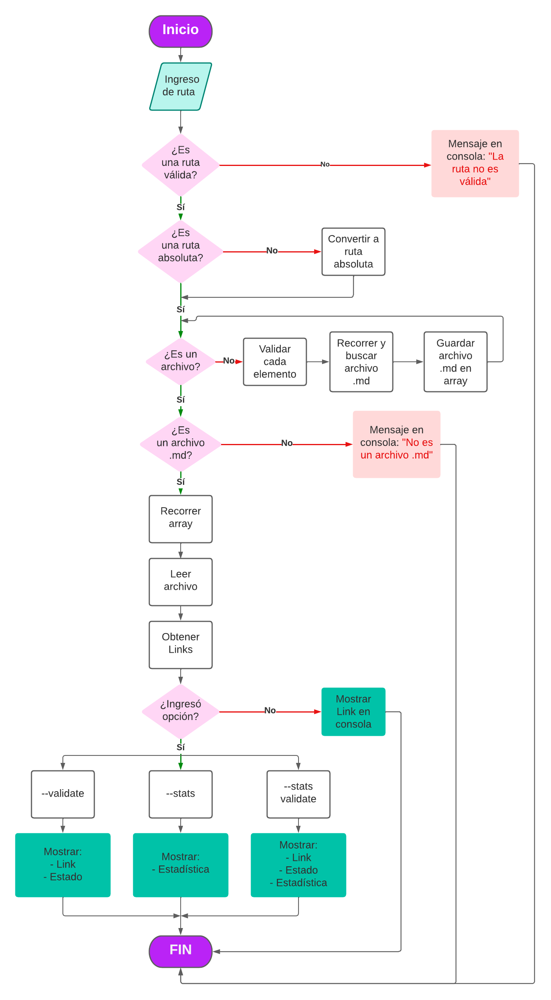

# andre-mdlinks

## Índice

* [1. Preámbulo](#1-preámbulo)
* [2. md-Links](#2-md-Links)
* [3. Instalación](#3-instalación)
* [4. Opciones de uso](#4-opciones-de-uso)
* [5. Consideraciones](#5-consideraciones)
* [6. Plan de acción para el desarrollo](#6-plan-de-acción-para-el-desarrollo)
* [7. Checklist](#7-checklist)

***

## 1. Preámbulo

[Markdown](https://es.wikipedia.org/wiki/Markdown) es un lenguaje de marcado
ligero muy popular entre developers. Es usado en muchísimas plataformas que
manejan texto plano (GitHub, foros, blogs, ...) y es muy común
encontrar varios archivos en ese formato en cualquier tipo de repositorio
(empezando por el tradicional `README.md`).

## 2. andre-mdlinks

`andre-mdLinks`, es una librería que te permite extraer los _links_ de tus archivos 
Markdown, detectar cuáles ya no son válidos y reportar algunas estadísticas.

## 3. Instalación

`npm install andrenavas/DEV005-md-links`

## 4. Opciones de uso

Se ejecuta en la terminal de la siguiente manera:

### Uso 1

`mdLinks <path-to-file-or-directory>`

Los valores retornados son:
* `href`: URL encontrada.
* `text`: Texto que aparecía dentro del link.
* `file`: Ruta del archivo donde se encontró el link.

Ejemplo: 

### Uso 2

`mdLinks <path-to-file-or-directory> --validate`

Los valores retornados son:
* `href`: URL encontrada.
* `text`: Texto que aparecía dentro del link.
* `file`: Ruta del archivo donde se encontró el link.
* `status`: Código de respuesta HTTP.
* `statusText`: Mensaje `Not Found` en caso de fallo u `OK` en caso de éxito.

Ejemplo: 

### Uso 3

`mdLinks <path-to-file-or-directory> --stats`

Los valores retornados son:
* `total`: Número de links encontrados.
* `unique`: Número de links que no se repiten.

Ejemplo: 

### Uso 4

`mdLinks <path-to-file-or-directory> --stats --validate`

también

`mdLinks <path-to-file-or-directory> --validate --stats`

Los valores retornados son:
* `total`: Número de links encontrados.
* `unique`: Número de links que no se repiten.
* `broken`: Número de links que no son válidos.

Ejemplo: 

## 5. Consideraciones

* Se usaron librerías externas como: [Colors](https://www.npmjs.com/package/colors), [Node-Fetch](https://www.npmjs.com/package/node-fetch) y [JSDOM](https://www.npmjs.com/package/jsdom).
* Si deseas que tu consola se vea como en las imagenes, usa el tema `Dracula` en tu Visual Studio Code y la terminal de `Bash`.
* 

## 6. Plan de acción para el desarrollo

Lo primero que hice fue organizar las tareas en [GitHub-projects](https://github.com/users/andrenavas/projects/1), antes de comenzar a realizar el código realicé un diagrama de flujo que me permitió tener una visión más detallada y el paso a paso para realizar el proyecto, luego de eso realicé el boilerplate e instalé las dependecias.

### Diagrama de flujo

Con el diagrama de flujo listo, dividí el proyecto en tareas grandes: [Milestones](https://github.com/andrenavas/DEV005-md-links/milestones) y dentro de ellas tareas más específicas: Issues.

## 7. Checklist

### General

* [:ballot_box_with_check:] Puede instalarse via `npm install --global <github-user>/md-links`

### `README.md`

* [:ballot_box_with_check:] Un board con el backlog para la implementación de la librería.
* [:ballot_box_with_check:] Documentación técnica de la librería.
* [:ballot_box_with_check:] Guía de uso e instalación de la librería

### API `mdLinks(path, opts)`

* [:ballot_box_with_check:] El módulo exporta una función con la interfaz (API) esperada.
* [:ballot_box_with_check:] Implementa soporte para archivo individual
* [:ballot_box_with_check:] Implementa soporte para directorios
* [:ballot_box_with_check:] Implementa `options.validate`

### CLI

* [:ballot_box_with_check:] Expone ejecutable `mdLinks` en el path (configurado en `package.json`)
* [:ballot_box_with_check:] Se ejecuta sin errores / output esperado
* [:ballot_box_with_check:] Implementa `--validate`
* [:ballot_box_with_check:] Implementa `--stats`

### Pruebas / tests

* [:ballot_box_with_check:] Pruebas unitarias cubren un mínimo del 70% de statements, functions,
  lines, y branches.inte
* [:ballot_box_with_check:] Pasa tests (y lrs) (`npm test`).
